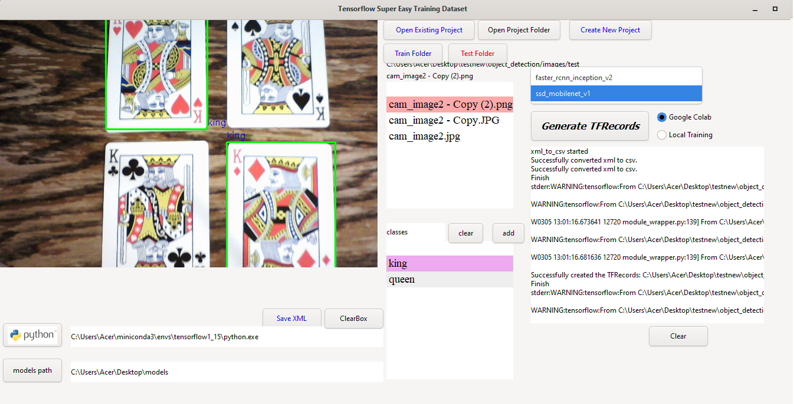
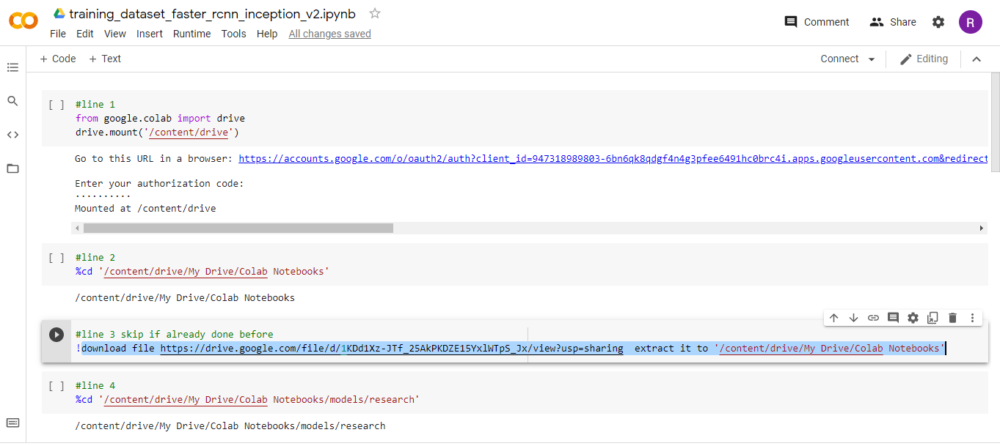
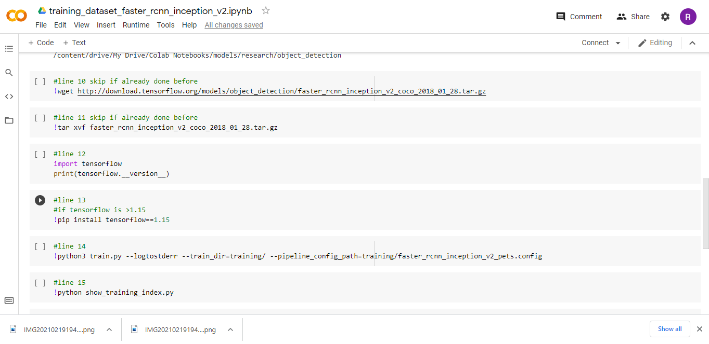

# TensorflowTrainingApp GTK3

No need for labelimage(already builtin) 

No Terminal command needed while creating TFRecords

SSD or fasterRCNN

Local training or Google Colab training of dataset

Click and execute in Colab ipynb(no need to type every commands)

Tested in Windows 10 and MAC OS march 2021

To use this follow the instruction in this Github repo
https://github.com/chiptrontech/WiredGTK-Windows-7-10-Installation
